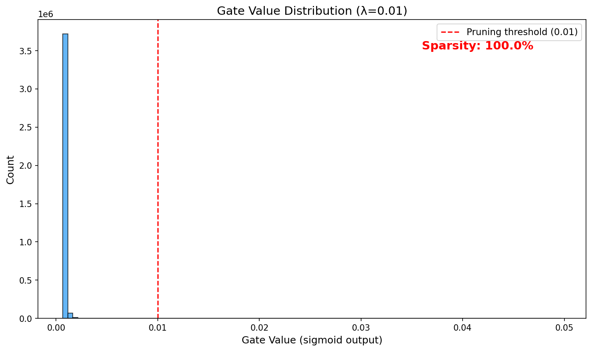
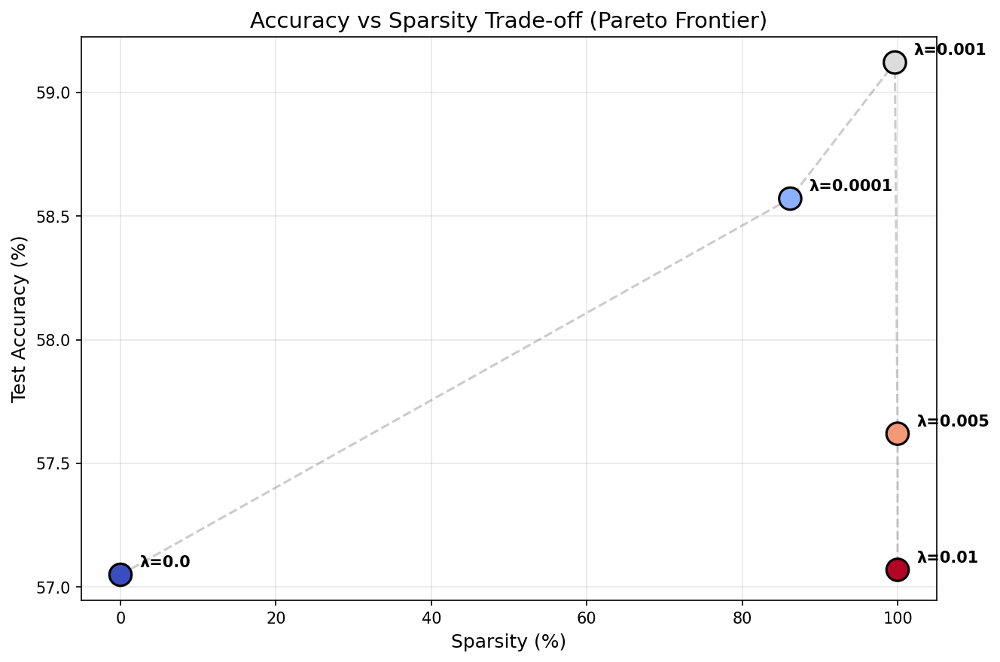
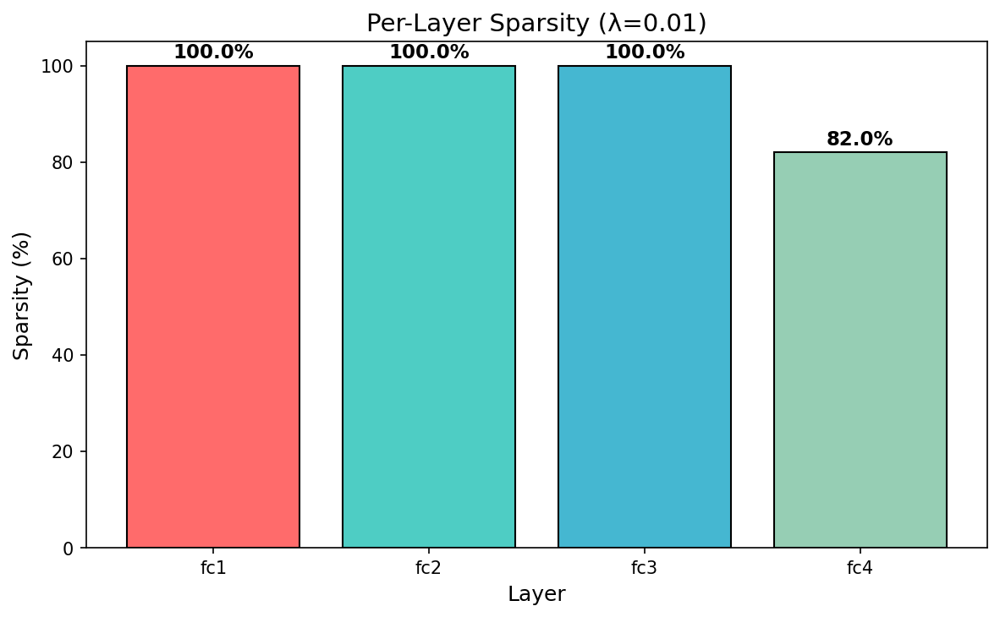

# Self-Pruning Neural Network

A feed-forward neural network that learns to prune its own weights during training using differentiable gating and L1 sparsity regularization. Trained on CIFAR-10.

## What This Does

Instead of the usual train → prune → fine-tune pipeline, this network figures out which connections are unnecessary *while* it's training. Each weight has a learnable gate parameter. During forward pass, weights get multiplied by `sigmoid(gate_scores)` — so gates near 0 effectively kill that connection. An L1 penalty on the gate values pushes the network to shut off whatever it doesn't need.

This connects to a few ideas in the literature:
- The **Lottery Ticket Hypothesis** (Frankle & Carbin, 2019) — sparse subnetworks can match dense performance
- **L0 Regularization** (Louizos et al., 2018) — learning hard gates via continuous relaxations
- **Learning Both Weights and Connections** (Han et al., 2015) — magnitude-based pruning baselines

## Results

| λ (Lambda) | Test Accuracy | Sparsity | Active / Total Params | Compression |
|-----------|---------------|----------|----------------------|-------------|
| 0.0       | 57.05%        | 0.0%     | 3,803,648 / 3,803,648 | 1× (baseline) |
| 0.0001    | 58.57%        | 86.2%    | 526,005 / 3,803,648   | 7.2× |
| **0.001** | **59.12%** ⭐  | **99.6%** | **13,724 / 3,803,648** | **277×** |
| 0.005     | 57.62%        | 100.0%   | 742 / 3,803,648       | 5,126× |
| 0.01      | 57.07%        | 100.0%   | 460 / 3,803,648       | 8,269× |

λ=0.001 is the sweet spot — **2.07% higher accuracy** than the unpruned baseline while pruning **99.6% of connections**. Only 13,724 out of 3.8M gate parameters stay active. The sparsity penalty doubles as a regularizer.

### Sample Visualizations

| Gate Distribution (λ=0.001) | Accuracy vs Sparsity | Per-Layer Sparsity |
|:--:|:--:|:--:|
|  |  |  |

Full analysis with training curves, gate evolution, and per-layer breakdown in [`report.md`](report.md).

## Architecture

```
Input (3×32×32 = 3072) → Flatten
  → PrunableLinear(3072, 1024) → BatchNorm → ReLU → Dropout(0.2)
  → PrunableLinear(1024, 512)  → BatchNorm → ReLU → Dropout(0.2)
  → PrunableLinear(512, 256)   → BatchNorm → ReLU → Dropout(0.2)
  → PrunableLinear(256, 10)    → Output (logits)
```

**PrunableLinear** is a custom module (no `torch.nn.Linear`) with:
- `weight` — Kaiming uniform init
- `bias` — zero init
- `gate_scores` — initialized to +2.0 (sigmoid(2) ≈ 0.88, all gates start mostly open)

Forward: `output = input @ (weight * sigmoid(gate_scores)).T + bias`

**Total parameters**: 7,612,682 (3,803,648 of which are gate parameters subject to pruning)

## Training

**Loss**: `CrossEntropyLoss + λ × Σ sigmoid(gate_scores)`

The L1 penalty on sigmoid gates pushes gate scores toward negative infinity (sigmoid → 0), zeroing out the corresponding weights. Unlike L2 which just makes things small, L1 drives gates all the way to zero — you get actual sparsity, not just small values.

**Config**: Adam (lr=0.001), 20 epochs, batch size 64, seed 42

## Project Structure

```
.
├── self_pruning_network.py   # Everything — model, training, eval, plots
├── report.md                 # Analysis and findings
├── results.json              # Raw numbers for all experiments
├── requirements.txt
├── figures/                  # 17 generated plots
│   ├── gate_distribution_*.png
│   ├── layer_sparsity_*.png
│   ├── pareto_frontier.png
│   ├── training_curves.png
│   ├── gate_evolution.png
│   └── effective_parameters.png
└── checkpoints/              # Saved model states
```

## How to Run

```bash
python3 -m venv venv
source venv/bin/activate
pip install -r requirements.txt
python3 self_pruning_network.py
```

Takes about 80 minutes on Apple M1 (MPS) for all 5 λ configs. Auto-detects MPS/CUDA/CPU.

## References

- Frankle, J., & Carbin, M. (2019). The Lottery Ticket Hypothesis: Finding Sparse, Trainable Neural Networks. ICLR.
- Louizos, C., Welling, M., & Kingma, D. P. (2018). Learning Sparse Neural Networks through L0 Regularization. ICLR.
- Han, S., Pool, J., Tran, J., & Dally, W. J. (2015). Learning Both Weights and Connections for Efficient Neural Networks. NeurIPS.

## License

MIT
