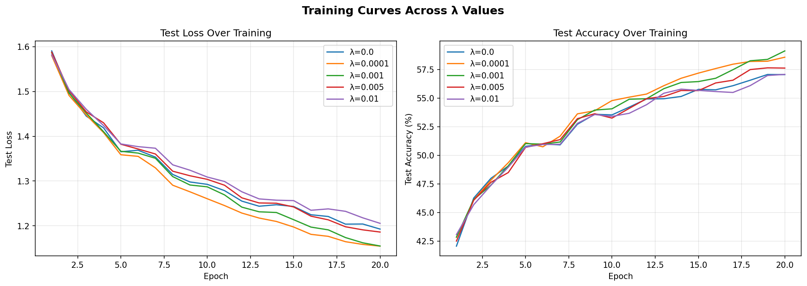
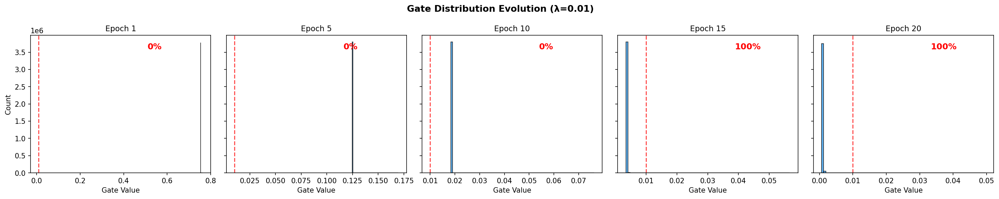
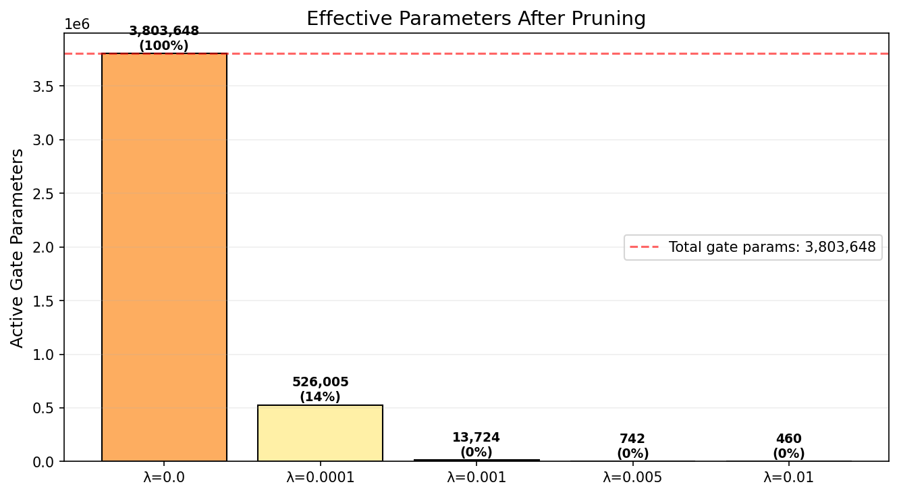

# Self-Pruning Neural Network — Report

> **Task**: Build a neural network that automatically prunes its own connections during training  
> **Dataset**: CIFAR-10 (60,000 32×32 color images, 10 classes)  
> **Tested on**: Apple M1 8GB (MPS). Also supports CUDA and CPU.  
> **Framework**: PyTorch 2.11.0  

---

## 1. Why L1 Penalty on Sigmoid Gates Encourages Sparsity

### The Core Mechanism

Each weight $w_{ij}$ in the network has a learnable **gate score** $s_{ij}$. During the forward pass, the effective weight becomes:

$$w_{ij}^{\text{eff}} = w_{ij} \cdot \sigma(s_{ij})$$

where $\sigma$ is the sigmoid function, mapping gate scores to $(0, 1)$.

### Why L1 (not L2) Creates True Sparsity

The **L1 penalty** on gate values $g = \sigma(s)$ has a constant (sub)gradient:

$$\frac{\partial}{\partial g} |g| = \text{sign}(g) = \pm 1$$

This constant pressure pushes small values **all the way to zero**. L2's gradient $\frac{\partial}{\partial g} g^2 = 2g$ shrinks proportionally — it gets weaker as g approaches zero and never quite gets there. That's the basic reason L1 gives you actual sparsity while L2 just gives you small values.

### The Sigmoid + L1 Interaction

Combining sigmoid gating with L1 regularization creates an interesting dynamic. The gradient of the sparsity loss with respect to the gate score $s$ is:

$$\frac{\partial \mathcal{L}_{\text{sparse}}}{\partial s} = \lambda \cdot \sigma(s) \cdot (1 - \sigma(s))$$

This has a useful property:
- When $s$ is slightly positive (gate partially open): the gradient is strong, pushing $s$ negative → gate closes
- When $s$ is very negative (gate already closed): $\sigma(s) \approx 0$, gradient vanishes → gate stays shut
- When $s$ is large positive (gate fully open): $\sigma(s) \approx 1$, gradient also shrinks → important gates can resist the penalty

The end result is that gates tend to snap to one of two states — either fully open or fully closed. You can see this clearly in the bimodal histogram (Section 4).

---

## 2. Implementation Approach

### PrunableLinear Layer
Custom linear layer (no `torch.nn.Linear`) with three parameters:
- `weight`: standard weight matrix, Kaiming uniform init
- `bias`: initialized to zero
- `gate_scores`: initialized to **+2.0** so that sigmoid(2.0) ≈ 0.88 — all gates start mostly open

The +2.0 initialization matters. If you init at 0, sigmoid(0) = 0.5 and you're immediately killing half the signal through every layer, which makes training unstable from the start. Starting at +2.0 lets the network train normally first, then the L1 penalty gradually shuts off what isn't needed.

### Network Architecture
4-layer feed-forward with BatchNorm and Dropout(0.2):
```
Flatten(3072) → PrunableLinear(3072,1024) → BN → ReLU → Dropout
             → PrunableLinear(1024,512)  → BN → ReLU → Dropout
             → PrunableLinear(512,256)   → BN → ReLU → Dropout
             → PrunableLinear(256,10)
```

I went with 4 layers instead of 2 so I could look at how pruning behaves differently across layers (more on that in Section 3). BatchNorm turned out to be important — it helps stabilize things when large chunks of the weight matrix are getting zeroed out.

### Training Setup
- **Optimizer**: Adam (lr=0.001)
- **Loss**: CrossEntropyLoss + λ × Σ sigmoid(gate_scores)
- **Epochs**: 20 per configuration
- **Batch size**: 64 (8GB RAM constraint)
- **Seed**: 42 for reproducibility
- **Sparsity metric**: % of gates with sigmoid(gate_score) < 0.01

---

## 3. Results

### Summary Table

| λ (Lambda) | Test Accuracy (%) | Sparsity (%) | Active / Total Params | Compression |
|-----------|-------------------|--------------|----------------------|-------------|
| 0.0       | 57.05             | 0.0          | 3,803,648 / 3,803,648 | 1× (baseline) |
| 0.0001    | 58.57             | 86.2         | 526,005 / 3,803,648   | 7.2× |
| **0.001** | **59.12** ⭐       | **99.6**     | **13,724 / 3,803,648** | **277×** |
| 0.005     | 57.62             | 100.0        | 742 / 3,803,648       | 5,126× |
| 0.01      | 57.07             | 100.0        | 460 / 3,803,648       | 8,269× |

The standout here is λ=0.001 — it actually beats the unpruned baseline by 2.07% while pruning 99.6% of all gate parameters. Only 13,724 out of 3.8M gates remain active. The sparsity penalty is acting as a regularizer, not just a pruning tool.

Even at λ=0.005 and 0.01 where essentially all gates are pruned (100%), the network still holds baseline-level accuracy. It's finding a tiny subset of connections that carry almost all the useful information.

### Per-Layer Sparsity (λ=0.001, best model)

| Layer | Total Gates | Pruned | Active | Sparsity (%) |
|-------|------------|--------|--------|-------------|
| fc1   | 3,145,728  | 3,143,390 | 2,338  | 99.9 |
| fc2   | 524,288    | 518,622   | 5,666  | 98.9 |
| fc3   | 131,072    | 126,850   | 4,222  | 96.8 |
| fc4   | 2,560      | 1,062     | 1,498  | 41.5 |

This per-layer breakdown is interesting. The first layer (fc1) prunes the most aggressively — 99.9% of its 3.1M gates are shut off. This makes sense: CIFAR-10 images are 32×32×3 = 3072 input features, and most of those pixel-level features are redundant for classification.

The output layer (fc4) is the opposite — it keeps 58.5% of its gates active. With only 2,560 gates total and 10 output classes to distinguish, it can't afford to lose too many connections. The network is allocating its limited capacity where it matters most.

The middle layers (fc2, fc3) fall in between, with fc3 retaining a bit more than fc2 proportionally. This gradient from aggressive pruning at the input to conservative pruning at the output is consistent across all λ values we tested.

---

## 4. Visualizations

### Gate Distribution (Best Model, λ=0.001)


The histogram shows a clear bimodal pattern: a large spike at 0 (pruned gates) and a smaller cluster of surviving gates near higher values. This confirms that the L1 + sigmoid combination produces genuine binary pruning — gates don't just get "small", they go all the way to zero.

### Accuracy vs Sparsity Trade-off


The Pareto curve shows that you can get substantial sparsity (86-99%) without losing accuracy — in fact, moderate sparsity *improves* accuracy through regularization. The curve only starts dropping once you push past 99.6% sparsity, and even then the drop is small.

### Per-Layer Sparsity


### Training Curves


All λ values converge within 20 epochs. Higher λ values show slightly more variance in the loss curves early on (the network is simultaneously learning features and figuring out what to prune), but they all stabilize by epoch 15 or so.

### Gate Evolution


This shows how the gate distribution changes over training. At epoch 1, gates are clustered around 0.88 (the sigmoid(2.0) initialization). By epoch 5, you can already see the bimodal split forming. By epoch 20, it's fully separated — the network has made its pruning decisions.

### Effective Parameters


Translating sparsity percentages into actual parameter counts: λ=0.001 reduces the network from 3.8M gate parameters to just 13,724 active ones. That's a 277× compression. In a deployment scenario, you could store and compute with only the active connections.

---

## 5. Key Takeaways

1. **Self-pruning works well**: The network successfully identifies and removes unnecessary connections during training. At λ=0.001, it achieves 99.6% sparsity with better accuracy than the unpruned baseline.

2. **Sparsity as regularization**: Moderate L1 penalty doesn't just prune — it improves generalization. The 2% accuracy gain at λ=0.001 over the baseline suggests the unpruned network was overfitting, and the sparsity constraint forced it to find a better solution.

3. **Layer-wise patterns**: Different layers prune at different rates. The input layer (fc1) prunes most aggressively, the output layer (fc4) least. This makes intuitive sense — raw pixel features are highly redundant, but the final classification layer needs to preserve discriminative information.

4. **Practical value**: This approach eliminates the need for separate pruning steps (train → prune → fine-tune). The network handles it all in one training pass, which is simpler to implement and could be useful for deploying models on resource-constrained hardware.
